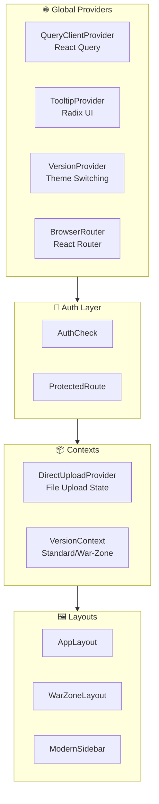
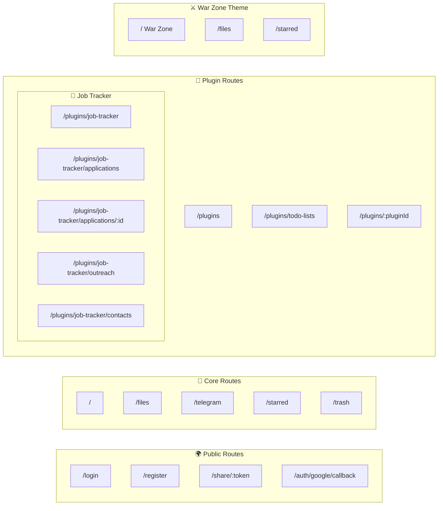
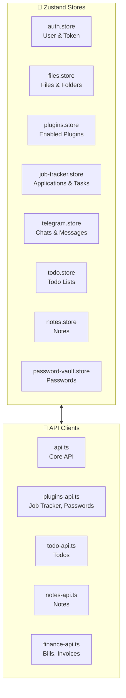
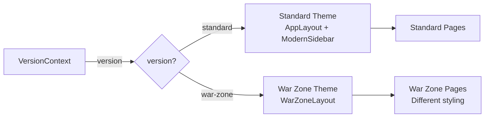
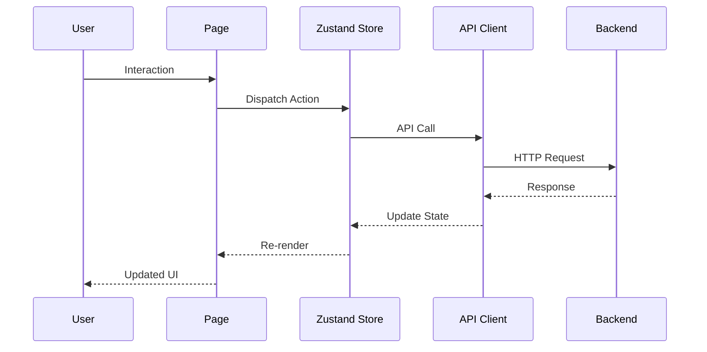

# TAAS Frontend UI Architecture

## Overview



---

## Route Structure



---

## Page Hierarchy

| Route | Page Component | Layout | Description |
|-------|---------------|--------|-------------|
| `/` | `ModernDashboardPage` | AppLayout | Main dashboard with stats |
| `/files` | `MyFilesPage` | AppLayout | File browser |
| `/telegram` | `TelegramChatsPage` | AppLayout | Import from Telegram |
| `/starred` | `StarredPage` | AppLayout | Favorited files |
| `/trash` | `TrashPage` | AppLayout | Deleted files |
| `/plugins` | `PluginsPage` | AppLayout | Plugin marketplace |
| `/plugins/job-tracker` | `JobTrackerDashboardPage` | Sidebar only | Job search dashboard |
| `/plugins/job-tracker/applications` | `JobApplicationsPage` | Sidebar only | All applications |
| `/plugins/job-tracker/applications/:id` | `JobApplicationFormPage` | Sidebar only | Edit application |
| `/plugins/job-tracker/outreach` | `OutreachPage` | AppLayout | Email tracking |
| `/plugins/job-tracker/contacts` | `ContactFinderPage` | AppLayout | Standalone email finder |
| `/plugins/todo-lists` | `TodoPage` | AppLayout | Todo lists |
| `/login` | `LoginPage` | None | Auth page |
| `/register` | `RegisterPage` | None | Auth page |
| `/share/:token` | `SharePage` | None | Public share link |

---

## State Management



---

## Component Hierarchy

```
src/
├── components/
│   ├── layout/
│   │   ├── AppLayout.tsx        # Main app wrapper
│   │   └── ModernSidebar.tsx    # Icon sidebar navigation
│   │
│   ├── dashboard/               # Dashboard widgets
│   │
│   ├── ui/                      # Radix UI primitives
│   │   ├── button.tsx
│   │   ├── dialog.tsx
│   │   ├── tooltip.tsx
│   │   └── ...
│   │
│   ├── war-zone/               # War Zone theme components
│   │
│   └── [Feature Components]
│       ├── FileCard.tsx
│       ├── FolderCard.tsx
│       ├── FileUploader.tsx
│       ├── ShareDialog.tsx
│       ├── AddJobDialog.tsx
│       ├── EmailComposerDialog.tsx
│       ├── CompanyContactsDialog.tsx
│       └── ...
│
├── contexts/
│   ├── DirectUploadContext.tsx  # Upload queue state
│   └── VersionContext.tsx       # Theme switching
│
├── stores/                      # Zustand stores
│
├── lib/                         # Utilities & API clients
│
└── pages/                       # Route pages
    ├── war-zone/               # Alt theme pages
    └── [Page Components]
```

---

## Theme System



---

## Key Dialogs & Modals

| Dialog | Purpose | Trigger Location |
|--------|---------|-----------------|
| `AddJobDialog` | Add new job application | Job Tracker Dashboard |
| `CompanyContactsDialog` | Find contacts at company | Job Application Form |
| `EmailComposerDialog` | Compose & send emails | Contact Finder, Applications |
| `JobTrackerSettingsDialog` | Configure API keys | Job Tracker pages |
| `ShareDialog` | Create share links | File context menu |
| `FilePickerDialog` | Select files for attachment | Job Application Form |
| `AccountSettingsDialog` | User settings | Sidebar |
| `SyncDialog` | Device sync options | Dashboard |

---

## Data Flow


