# TAAS Frontend UI Architecture

## Overview

```mermaid
flowchart TB
    subgraph Providers["🌐 Global Providers"]
        QC[QueryClientProvider<br/>React Query]
        TP[TooltipProvider<br/>Radix UI]
        VP[VersionProvider<br/>Theme Switching]
        BR[BrowserRouter<br/>React Router]
    end

    subgraph Auth["🔐 Auth Layer"]
        AC[AuthCheck]
        PR[ProtectedRoute]
    end

    subgraph Contexts["📦 Contexts"]
        DU[DirectUploadProvider<br/>File Upload State]
        VC[VersionContext<br/>Standard/War-Zone]
    end

    subgraph Layouts["🖼️ Layouts"]
        AL[AppLayout]
        WL[WarZoneLayout]
        MS[ModernSidebar]
    end

    Providers --> Auth --> Contexts --> Layouts
```



---

## Route Structure

```mermaid
flowchart LR
    subgraph Public["🌍 Public Routes"]
        L["/login"]
        R["/register"]
        S["/share/:token"]
        OA["/auth/google/callback"]
    end

    subgraph Core["📁 Core Routes"]
        D["/"]
        F["/files"]
        TG["/telegram"]
        ST["/starred"]
        TR["/trash"]
    end

    subgraph Plugins["🔌 Plugin Routes"]
        PL["/plugins"]
        TD["/plugins/todo-lists"]
        
        subgraph JobTracker["💼 Job Tracker"]
            JD["/plugins/job-tracker"]
            JA["/plugins/job-tracker/applications"]
            JAF["/plugins/job-tracker/applications/:id"]
            JO["/plugins/job-tracker/outreach"]
            JC["/plugins/job-tracker/contacts"]
        end
        
        PC["/plugins/:pluginId"]
    end

    subgraph WarZone["⚔️ War Zone Theme"]
        WD["/" War Zone]
        WF["/files"]
        WS["/starred"]
    end
```



---

## Page Hierarchy

| Route | Page Component | Layout | Description |
|-------|---------------|--------|-------------|
| `/` | `ModernDashboardPage` | AppLayout | Main dashboard with stats |
| `/files` | `MyFilesPage` | AppLayout | File browser |
| `/telegram` | `TelegramChatsPage` | AppLayout | Import from Telegram |
| `/starred` | `StarredPage` | AppLayout | Favorited files |
| `/trash` | `TrashPage` | AppLayout | Deleted files |
| `/plugins` | `PluginsPage` | AppLayout | Plugin marketplace |
| `/plugins/job-tracker` | `JobTrackerDashboardPage` | Sidebar only | Job search dashboard |
| `/plugins/job-tracker/applications` | `JobApplicationsPage` | Sidebar only | All applications |
| `/plugins/job-tracker/applications/:id` | `JobApplicationFormPage` | Sidebar only | Edit application |
| `/plugins/job-tracker/outreach` | `OutreachPage` | AppLayout | Email tracking |
| `/plugins/job-tracker/contacts` | `ContactFinderPage` | AppLayout | Standalone email finder |
| `/plugins/todo-lists` | `TodoPage` | AppLayout | Todo lists |
| `/login` | `LoginPage` | None | Auth page |
| `/register` | `RegisterPage` | None | Auth page |
| `/share/:token` | `SharePage` | None | Public share link |

---

## State Management

```mermaid
flowchart TB
    subgraph Zustand["🐻 Zustand Stores"]
        AS[auth.store<br/>User & Token]
        FS[files.store<br/>Files & Folders]
        PS[plugins.store<br/>Enabled Plugins]
        JTS[job-tracker.store<br/>Applications & Tasks]
        TS[telegram.store<br/>Chats & Messages]
        TDS[todo.store<br/>Todo Lists]
        NS[notes.store<br/>Notes]
        PVS[password-vault.store<br/>Passwords]
    end

    subgraph APIs["📡 API Clients"]
        API[api.ts<br/>Core API]
        PAPI[plugins-api.ts<br/>Job Tracker, Passwords]
        TAPI[todo-api.ts<br/>Todos]
        NAPI[notes-api.ts<br/>Notes]
        FAPI[finance-api.ts<br/>Bills, Invoices]
    end

    Zustand <--> APIs
```



---

## Component Hierarchy

```
src/
├── components/
│   ├── layout/
│   │   ├── AppLayout.tsx        # Main app wrapper
│   │   └── ModernSidebar.tsx    # Icon sidebar navigation
│   │
│   ├── dashboard/               # Dashboard widgets
│   │
│   ├── ui/                      # Radix UI primitives
│   │   ├── button.tsx
│   │   ├── dialog.tsx
│   │   ├── tooltip.tsx
│   │   └── ...
│   │
│   ├── war-zone/               # War Zone theme components
│   │
│   └── [Feature Components]
│       ├── FileCard.tsx
│       ├── FolderCard.tsx
│       ├── FileUploader.tsx
│       ├── ShareDialog.tsx
│       ├── AddJobDialog.tsx
│       ├── EmailComposerDialog.tsx
│       ├── CompanyContactsDialog.tsx
│       └── ...
│
├── contexts/
│   ├── DirectUploadContext.tsx  # Upload queue state
│   └── VersionContext.tsx       # Theme switching
│
├── stores/                      # Zustand stores
│
├── lib/                         # Utilities & API clients
│
└── pages/                       # Route pages
    ├── war-zone/               # Alt theme pages
    └── [Page Components]
```

---

## Theme System


---

## Key Dialogs & Modals

| Dialog | Purpose | Trigger Location |
|--------|---------|-----------------|
| `AddJobDialog` | Add new job application | Job Tracker Dashboard |
| `CompanyContactsDialog` | Find contacts at company | Job Application Form |
| `EmailComposerDialog` | Compose & send emails | Contact Finder, Applications |
| `JobTrackerSettingsDialog` | Configure API keys | Job Tracker pages |
| `ShareDialog` | Create share links | File context menu |
| `FilePickerDialog` | Select files for attachment | Job Application Form |
| `AccountSettingsDialog` | User settings | Sidebar |
| `SyncDialog` | Device sync options | Dashboard |

---

## Data Flow


